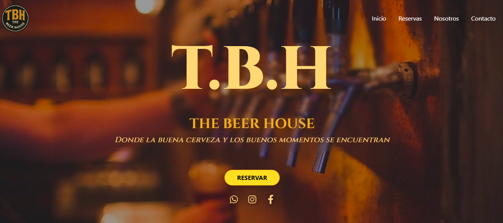

# 🍻 The Beer House

Bienvenido a **The Beer House**, un proyecto web desarrollado con Vite, ReactJS y TailwindCSS v4. Este sitio representa una landing page moderna para una cervecería artesanal, con diseño responsive y una experiencia visual atractiva.

---

## 🚀 Tecnologías Utilizadas

- ⚡️ [Vite](https://vitejs.dev/) — Bundler ultrarrápido para desarrollo web moderno.
- ⚛️ [React](https://react.dev/) — Biblioteca para construir interfaces de usuario.
- 🎨 [Tailwind CSS v4](https://tailwindcss.com/docs/installation) — Framework CSS utilitario para estilos rápidos y responsivos.

---

## 📸 Vista Previa

 <!-- Asegúrate de agregar una captura de pantalla del proyecto -->

---

## 📁 Estructura del Proyecto

```bash
TheBeerHouse/
├── public/
├── src/
│   ├── assets/
│   ├── components/
│   ├── pages/
│   ├── App.tsx
│   └── main.tsx
├── index.html
├── tailwind.config.js
├── vite.config.ts
└── package.json


🛠️ Instalación y Uso
Clonar el repositorio

bash
Copiar
Editar
git clone https://github.com/tu-usuario/the-beer-house.git
cd the-beer-house
Instalar dependencias

bash
Copiar
Editar
npm install
Iniciar el servidor de desarrollo

bash
Copiar
Editar
npm run dev
